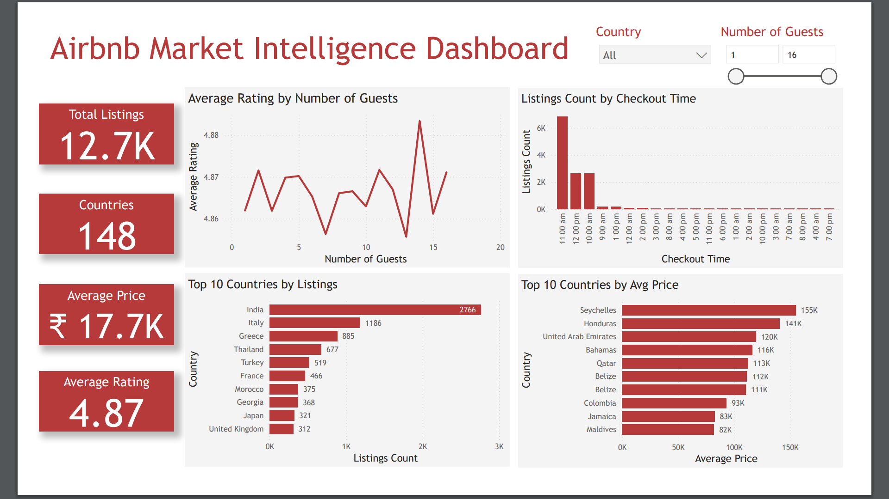

# Airbnb Market Analysis  
This project explores Airbnb listing data to uncover trends in pricing, availability, and location across cities using Python, Tableau, and Excel.

---

## Dataset Overview  
- **Source:** Airbnb Listings Dataset (Kaggle)  
- **Rows:** 48,000+ records  
- **Fields:** Listing ID, Name, Host ID, Neighbourhood, Room Type, Price, Minimum Nights, Number of Reviews, Availability, etc.

---

## Tools & Technologies

| Tool                       | Usage                                |
|----------------------------|--------------------------------------|
| Python                     | Data cleaning, EDA (.ipynb file)     |
| Pandas, Seaborn, Matplotlib| EDA and visual analysis              |
| Excel                      | Data checks and formatting           |
| Tableau                    | Interactive dashboard creation       |

---

## Dashboard Insights  

**Key Highlights:**
- **City-Wise Price Trends:** Prices vary drastically across locations and room types  
- **Room Types:** Entire home/apartment is the most listed room type  
- **High Activity Areas:** Specific neighborhoods dominate in number of listings and availability  
- **Availability:** Listings with 365-day availability are usually commercial in nature  
- **Top Revenue Zones:** Certain cities/neighborhoods yield higher ROI

---

## File Structure

Airbnb-Market-Analysis/
│
├── dashboard/
│ ├── Dashboard.twb # Tableau workbook
│ └── Dashboard.png # Dashboard image
│
├── data/
│ ├── airbnb_listings.csv # Raw dataset
│ └── airbnb_cleaned.xlsx # Cleaned data used for Tableau
│
├── notebooks/
│ └── airbnb_data_analysis.ipynb # Python EDA notebook
│
└── README.md

---

## What I Learned
- Performing deep exploratory analysis on location-based datasets  
- Identifying key pricing and availability patterns in Airbnb listings  
- Using Tableau for building spatial and categorical dashboards  
- Structuring end-to-end data projects professionally  

---

*This project is part of my Data Analyst Portfolio*
